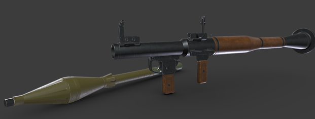
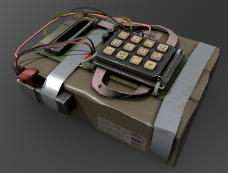
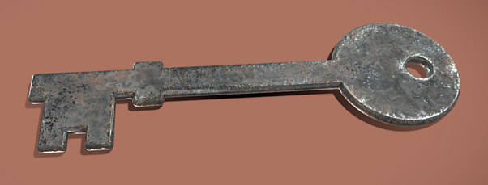

# Future Work

Sadly, I don't think I'll be continuing this game, but here is a list of improvements I would make if I did:
- Remove the physics based hand system (doesn’t do anything for this game)
- Make satchel position adjustable
- Make movement smoother
- Add functional terrain
- Extend the height of the climb
- Add checkpoints as originally planned
- More sfx and vfx, music, more interactables
- Multiplayer could allow people to race to the top

As for why I'm not continuing work on it, there are other games I want to make! I absolutely plan to continue working with Godot and am very happy with what I've learned in this course. Whether or not I'll continue working in VR I'm not sure. In general making games in VR is more work and sometimes rather annoying due to switching in and out of the headset so much, but there's some things I want to make that only VR can accomplish. I still want to make a sword fighting game in VR, but I believe my next project will be a 2D game so that I can get more experience before I take on such a project.

# Credits

### RPG7:
- MaX3d
- [https://sketchfab.com/3d-models/rpg7-e83a4ec772cf4a1a93b5b1f36bb0caaa](https://sketchfab.com/3d-models/rpg7-e83a4ec772cf4a1a93b5b1f36bb0caaa)

### C4 Explosive (used as satchel charge):
- \_Vadim2020\_
- [https://sketchfab.com/3d-models/c4-explosive-617d754683114b6a8244ececbd03365e](https://sketchfab.com/3d-models/c4-explosive-617d754683114b6a8244ececbd03365e)

### Simple Metal Key:
- Laurie Annis
- [https://sketchfab.com/3d-models/simple-metal-key-free-download-02ff32e5cadb4288b283594876a5f8db](https://sketchfab.com/3d-models/simple-metal-key-free-download-02ff32e5cadb4288b283594876a5f8db)

