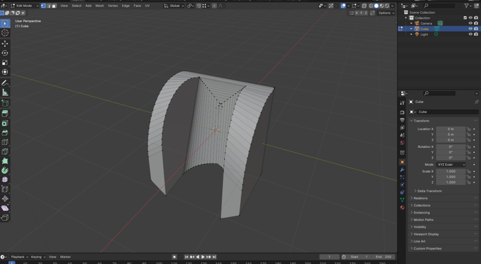
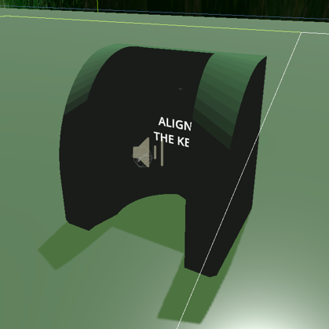

# Grab System
First, I'm going to discuss the immense challenge the custom grab system posed. For about a month I couldn't figure out how to solve a strange issue where grabbing objects worked fine until I rotated 180 degrees, at which point they would glitch around everwhere. A thousand Google searches, [a post to a help forum with no response](https://godotforums.org/d/38191-problem-with-rotation-using-physics-based-object-grabbing), and a lot of frustration later I finally came across a video that saved me [here](https://www.youtube.com/watch?v=Ri2xIhcii8I&ab_channel=SDGGames).

I didn't really understand quaternions, and never used them, so I thought they were just a more complicated form of representing rotation which computers used. In reality, quaternions are special because every angle has a unique representation that can only represent that angle. I won't explain quaternions or my problem in too much detail here since you can view them in the links above, but here's the code I used to solve it:

The following function returns a euler based angle difference that's easy to work with
```
func euler_angle_difference_from_quaternions(quat1: Quaternion, quat2: Quaternion) -> Vector3:
	var diff = quat1 * quat2.inverse()
	diff = diff.normalized().get_euler()
	return Vector3(diff.x, diff.y, diff.z)
```

I use the function above to multiply by a constant named rotation_strength and apply that as angular velocity to the held object. This rotates the object to match the orientation of the hand. I would later like to change this to apply force to the object rather than velocity so that it's actually "physics based".

```
held_object_body.angular_velocity = (
	euler_angle_difference_from_quaternions(
		Quaternion().from_euler(global_rotation),
		held_object_body.quaternion
	)
	* rotational_strength
)
```

There is a similar system to apply velocity to the object to match the position of the hand, but that was much simpler to implement and can be viewed in the project files in the script "controller.gd" if you're interested. 

Overall, this unnecessary grabbing system was the only significant challenge. Everything else after this felt much easier.

# Locomotion
Next up, I made the explosives. First I made the rocket launcher, which shoots out an exploding rocket, as expected. However, the explosion of the rocket doesn't hurt the player or anything else in the game, instead, it simply launches the player in the opposite direction. The code for the rocket and satchel are fairly similar, with the differences being that the rocket explodes on impact with a wall and the satchel explodes with a very short timer, and the satchel is a lot weaker than the rocket. This creates a difficult dynamic where you can only use the rocket when on the ground or close to a wall, and the satchel is the only option you have for movement when in the air.

### Making the explosions feel good
At first, the explosions felt wrong. Shooting a rocket right under your feet should send you straight up, and shooting a rocket on the ground 2 meters away from you should send you fairly horizontal in the opposite direction. The issue with my original implementation of this was that I had to either use the player's head or the player's feet as the target of the force, due to the way I had the player scene set up. The made the movement feel awkward since, if your head is the target of the force, shooting a rocket next to you would send you mostly upwards instead of horizontal. Heres are some simple visuals I made in MS Paint:


So, the solution here? Just create some fake points for the explosions to to affect!


In the images above, it may look like the target positions are above the player camera, but when the game loads the camera is moved up. The points placed inside the highlighted spheres are the points that the explosions look at when applying force to the player. After testing and fine tuning these both to make the rockets and satchel each feel more natural, I ended up with a significant improvement over the initial movement, even if it still isn't perfect. After that was done, I felt like my locomotion was complete enough to move on.

# Interaction
### The Key
Now I was ready to make my keys. I used a free 3D Key Model online (which you can find in the Extras blog) and needed to cut it up into 3 pieces. This took me an hour or two since I knew pretty much nothing about Blender, but I liked the final result:


You can watch the video in the results blog to see exactly how these work, but I put each of these pieces into the game, gave them a basic texture, and made them float and glow so the player could see them easily. Upon picking them all up, the player receives a key and can use that for the next point of interaction.

### The Shrine Thing
Next up, I needed something to use the key for. I couldn't quickly find anything online that matched what I wanted, so I just made my own:






As I didn't know what to call this, it is named the "Shrine Thing". It is the place the player goes to at the very top of the scene, places the key they collected all the pieces for, and ends the game. This only took me around 15 minutes, but it's actually one of the things I'm happiest about in this project since I learned a the basics of a new tool and made this from scratch all in a single day.

# Flight Cheat
Due to the nature of this game, I also added a simple flight cheat, so that users could still complete it even if they couldn't beat it normally. I think this was overall a good idea because both of my play testers ended up using it to some extent, and I don't blame them. I made the game to intentionally be difficult and time consuming and wouldn't expect anyone playing this so close to our project deadline to sink a bunch of time into it. That being said, I did complete it myself without any cheats, and you can see that in the next blog.